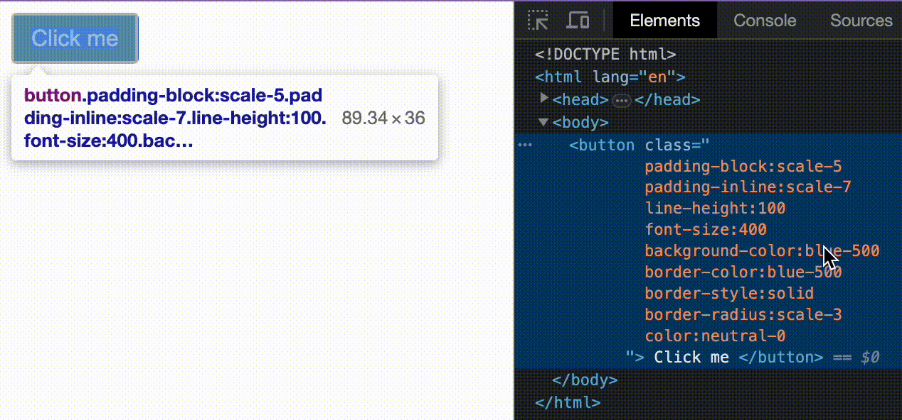

# JIT Compilation

Yass can optionally build only the styles you need. This is referred to as Just In Time (JIT) compilation. To enable JIT compilation, set the `src` option in your `yass.config.json` to point to your project's source directory. Yass will then traverse all files in that directory, looking for valid Yass classes. If they exist in your project, then they will be added to the resulting stylesheet.

## Limitations
Since Yass JIT compiles by doing string matching, class names that are not written explicitly will not be included in the generated stylesheet. For example, this will not work:
```jsx
  const Box = ({ color }) => (
    <div
      className={`
        background-color:${color}-500
        color:blue-${ color === 'neutral' ? '900' : '100' }
      `}
    >
      ❌
    </div>
  )
```
Yass has no way of knowing what value will be passed to the `color` prop. As a result, you will need to write write Yass classes explicitly, without interpolation:

```jsx
  const colors: {
    purple: `
      background-color:purple-500
      color:neutral-100
    `,
    neutral: `
      background-color:neutral-500
      color:neutral-900
    `,
  }

  const Box = ({ color }) => (
    <div className={colors[color]}>
      ✅
    </div>
  )
```

In the first example, no classes will be generated. In the second example the following classes will be generated:
```css
- background-color:purple-500
- color:neutral-100
- background-color:neutral-500
- color:neutral-900
```

## Production Build

JIT compilation drastically improves bundle size and should usually be enabled for your production build. You can, of course, opt not to set your `src` folder to opt out of JIT compilation. However, you then take on the responsibility of determining which classes you wish to keep/delete from your generated stylesheet.

## Development Build

During development, you may opt to disable JIT compilation for a few reasons. For example, you may want to enable browser editing to improve developer experience:


Yass does not currently natively support build tools like webpack, which would enable environment specific `yass.config.json` files. Better support for this will be worked on in future. 

